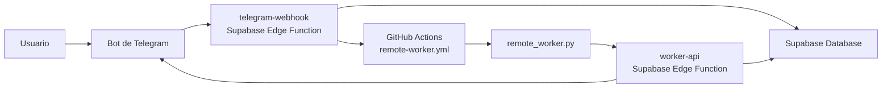
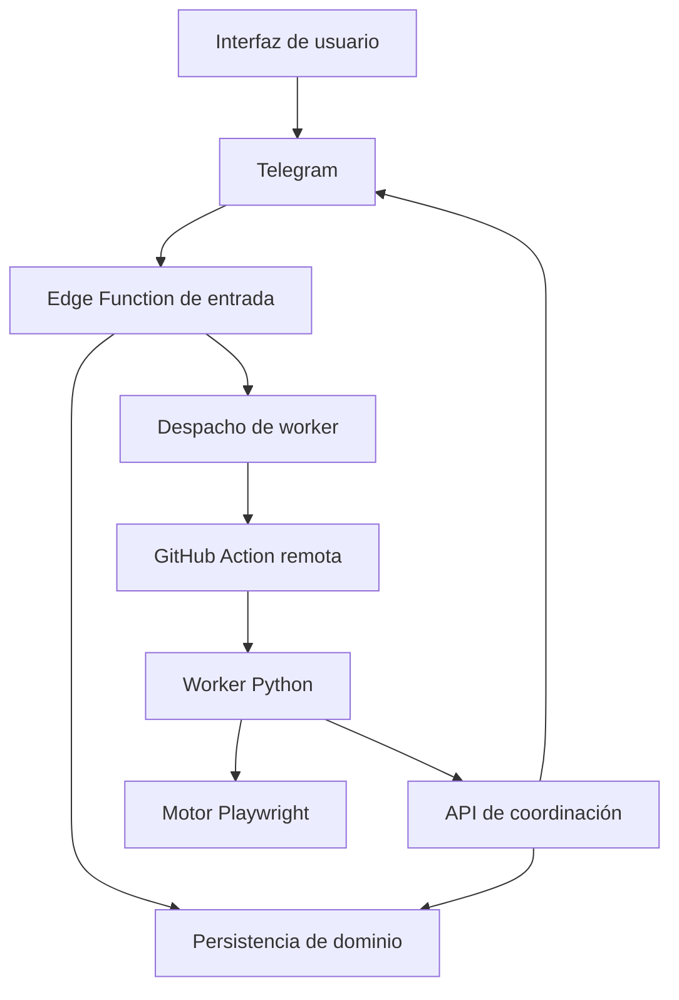
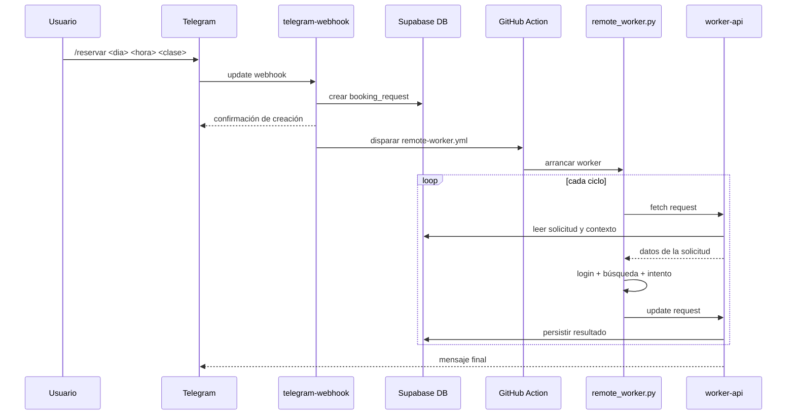

# VGymRobot

Motor de automatización para reservas de clases en VivaGym.

El repositorio contiene hoy tres carriles de ejecución que comparten el mismo núcleo Playwright:

1. `Local legacy`
2. `Local watch`
3. `Remote multi-user`

El objetivo funcional del sistema es:

- identificar una clase concreta por `día + hora + nombre`
- comprobar disponibilidad real
- intentar reservar
- repetir durante una ventana de vigilancia si no hay plaza en el primer intento

## Resumen rápido

La arquitectura actual se puede leer así:

- `Python + Playwright` es el motor real de reserva
- `Supabase` es la capa de backend y persistencia
- `Telegram` es la interfaz de usuario móvil
- `GitHub Actions` es el worker remoto que ejecuta el motor Playwright

## Arquitectura general

## Qué hace cada pieza

### Telegram

Telegram es la puerta de entrada para usuarios no técnicos.

Su papel es:

- recibir comandos del usuario
- entregar esos comandos al webhook configurado
- mostrar confirmaciones, estados y resultados

Telegram no ejecuta lógica de reserva. Solo actúa como interfaz conversacional.

### Supabase

Supabase es la capa de backend del sistema remoto.

Su papel es:

- almacenar cuentas y solicitudes
- exponer funciones serverless para entrada y coordinación
- servir de punto de verdad para el estado de una reserva

Dentro de Supabase hay dos piezas distintas:

1. `Database`
2. `Edge Functions`

### Database

La base de datos modela dos conceptos:

- `member_accounts`
- `booking_requests`

`member_accounts` representa la cuenta operativa de cada usuario del bot.  
`booking_requests` representa cada solicitud concreta de reserva.

La definición vive en [schema.sql](/Users/alopez/vgymrobot/vgymrobot/supabase/schema.sql).

### Edge Functions

Hay dos funciones principales:

- [telegram-webhook](/Users/alopez/vgymrobot/vgymrobot/supabase/functions/telegram-webhook/index.ts)
- [worker-api](/Users/alopez/vgymrobot/vgymrobot/supabase/functions/worker-api/index.ts)

`telegram-webhook` recibe comandos desde Telegram y los transforma en acciones del sistema.

`worker-api` es la interfaz que usa el worker remoto para:

- cargar una solicitud
- cargar el contexto asociado a esa solicitud
- persistir el resultado de cada intento

### GitHub Actions

GitHub Actions no hace de backend. Hace de entorno de ejecución remoto.

Su papel es:

- arrancar un runner efímero
- instalar dependencias
- lanzar el worker Python con Playwright
- mantener el bucle de reintentos durante una ventana temporal

El workflow principal de esta arquitectura es:

- [remote-worker.yml](/Users/alopez/vgymrobot/vgymrobot/.github/workflows/remote-worker.yml)

### Python + Playwright

Python es el núcleo del sistema.

Su papel es:

- transformar una solicitud de reserva en acciones concretas sobre la web
- navegar por la SPA de VivaGym
- decidir si una clase coincide con lo pedido
- ejecutar el click de reserva
- evaluar el resultado del intento

## Vista técnica por capas

## Modos de ejecución

## 1. Local legacy

Entrada:

- [main.py](/Users/alopez/vgymrobot/vgymrobot/src/main.py)

Descripción:

- carga `preferences.yaml`
- carga credenciales desde `.env`
- decide qué targets están “activos hoy”
- ejecuta Playwright en local
- usa un bucle interno de reintentos con `RetryManager`

Cuándo encaja:

- pruebas locales
- exploración del DOM
- uso de una sola cuenta

## 2. Local watch

Entrada:

- [local_watch.py](/Users/alopez/vgymrobot/vgymrobot/src/local_watch.py)

Descripción:

- crea o reactiva una solicitud local
- persiste el estado en [requests.json](/Users/alopez/vgymrobot/vgymrobot/state/requests.json)
- ejecuta un intento completo por ciclo
- espera entre ciclos
- termina en `booked`, `expired` o `cancelled`

Cuándo encaja:

- quieres simular el patrón real de vigilancia periódica
- quieres controlar localmente intervalo y duración

## 3. Remote multi-user

Entradas y piezas:

- Telegram
- Supabase
- GitHub Actions
- Python worker remoto

Descripción:

- el usuario crea una solicitud desde el móvil
- el backend la persiste
- el backend dispara un worker remoto
- el worker consulta el estado de la solicitud y ejecuta Playwright
- el resultado final vuelve al backend y al usuario

Cuándo encaja:

- varios usuarios
- operación desatendida
- uso desde móvil
- evitar depender de una máquina local encendida

## Artefactos del repositorio

### Código Python

- [auth.py](/Users/alopez/vgymrobot/vgymrobot/src/auth.py)
  - login y verificación de sesión

- [booking.py](/Users/alopez/vgymrobot/vgymrobot/src/booking.py)
  - navegación a reservas, selección de día, matching de clase y lógica de reserva

- [config.py](/Users/alopez/vgymrobot/vgymrobot/src/config.py)
  - carga de configuración base y ensamblado de `AppConfig`

- [retry.py](/Users/alopez/vgymrobot/vgymrobot/src/retry.py)
  - gestión de reintentos del carril legacy

- [request_state.py](/Users/alopez/vgymrobot/vgymrobot/src/request_state.py)
  - modelo de solicitud local persistida

- [request_create.py](/Users/alopez/vgymrobot/vgymrobot/src/request_create.py)
  - alta de solicitudes del carril clásico

- [process_requests.py](/Users/alopez/vgymrobot/vgymrobot/src/process_requests.py)
  - procesamiento del carril clásico basado en archivo

- [local_watch.py](/Users/alopez/vgymrobot/vgymrobot/src/local_watch.py)
  - vigilancia local cíclica

- [remote_worker.py](/Users/alopez/vgymrobot/vgymrobot/src/remote_worker.py)
  - worker remoto de larga duración

- [worker_api.py](/Users/alopez/vgymrobot/vgymrobot/src/worker_api.py)
  - cliente Python hacia el backend remoto

- [notifier.py](/Users/alopez/vgymrobot/vgymrobot/src/notifier.py)
  - abstracción de notificaciones

- [logger.py](/Users/alopez/vgymrobot/vgymrobot/src/logger.py)
  - logging común

### Workflows de GitHub

- [request.yml](/Users/alopez/vgymrobot/vgymrobot/.github/workflows/request.yml)
  - alta manual de solicitudes en el carril clásico

- [book.yml](/Users/alopez/vgymrobot/vgymrobot/.github/workflows/book.yml)
  - procesamiento periódico del carril clásico

- [remote-worker.yml](/Users/alopez/vgymrobot/vgymrobot/.github/workflows/remote-worker.yml)
  - worker remoto multiusuario

### Supabase

- [schema.sql](/Users/alopez/vgymrobot/vgymrobot/supabase/schema.sql)
  - modelo de datos

- [config.toml](/Users/alopez/vgymrobot/vgymrobot/supabase/config.toml)
  - configuración de despliegue de funciones

- [telegram-webhook/index.ts](/Users/alopez/vgymrobot/vgymrobot/supabase/functions/telegram-webhook/index.ts)
  - función de entrada desde Telegram

- [worker-api/index.ts](/Users/alopez/vgymrobot/vgymrobot/supabase/functions/worker-api/index.ts)
  - función de coordinación con el worker remoto

- [_shared/crypto.ts](/Users/alopez/vgymrobot/vgymrobot/supabase/functions/_shared/crypto.ts)
  - utilidades compartidas de cifrado

- [_shared/github.ts](/Users/alopez/vgymrobot/vgymrobot/supabase/functions/_shared/github.ts)
  - utilidades para disparar workflows

- [_shared/telegram.ts](/Users/alopez/vgymrobot/vgymrobot/supabase/functions/_shared/telegram.ts)
  - utilidades para enviar mensajes a Telegram

## Modelo de dominio

### `member_accounts`

Representa la cuenta operativa asociada a un usuario del bot.

Responsabilidades:

- vincular la identidad del usuario con una cuenta de reserva
- almacenar el contexto estable de ese usuario
- servir como dueño lógico de las solicitudes

### `booking_requests`

Representa una petición concreta de vigilancia y reserva.

Responsabilidades:

- identificar la clase objetivo
- guardar la ventana temporal de vigilancia
- registrar intentos y resultados
- mantener el estado final

Estados típicos:

- `pending`
- `booked`
- `expired`
- `cancelled`
- `error`

## Flujo completo de una solicitud remota

## Qué modela el comportamiento del bot

La lógica de producto no está en un solo sitio. Se reparte en varias capas.

### La “intención” de una reserva

La modelan:

- `day`
- `time`
- `class_name`
- `target_date`
- `watch_until`
- `interval_seconds`

Esa combinación vive sobre todo en:

- la fila de `booking_requests`
- el objeto `BookingTarget` en Python

### La “ejecución” de una reserva

La modelan:

- [remote_worker.py](/Users/alopez/vgymrobot/vgymrobot/src/remote_worker.py)
- [booking.py](/Users/alopez/vgymrobot/vgymrobot/src/booking.py)
- [auth.py](/Users/alopez/vgymrobot/vgymrobot/src/auth.py)

Ahí se decide:

- cuándo empezar un intento
- cuándo detener el bucle
- cómo navegar
- cómo identificar la clase correcta
- cómo interpretar el resultado del click

### La “orquestación” de una reserva

La modelan:

- [telegram-webhook/index.ts](/Users/alopez/vgymrobot/vgymrobot/supabase/functions/telegram-webhook/index.ts)
- [worker-api/index.ts](/Users/alopez/vgymrobot/vgymrobot/supabase/functions/worker-api/index.ts)
- [remote-worker.yml](/Users/alopez/vgymrobot/vgymrobot/.github/workflows/remote-worker.yml)

Ahí se decide:

- cómo nace una solicitud
- qué worker la ejecuta
- dónde se persiste el estado
- cómo vuelve el resultado al usuario

## Qué hace exactamente `telegram-webhook`

`telegram-webhook` es el adaptador entre un mensaje de Telegram y el dominio del proyecto.

Responsabilidades:

- aceptar comandos entrantes
- normalizar el texto
- decidir qué comando se ha recibido
- resolver la identidad del usuario
- crear o consultar entidades en base de datos
- disparar el worker remoto cuando procede
- responder por Telegram

No hace Playwright. No interactúa con VivaGym.

## Qué hace exactamente `worker-api`

`worker-api` es el punto de coordinación entre el runner remoto y la persistencia.

Responsabilidades:

- entregar al worker el contexto de una solicitud
- aceptar updates del worker
- consolidar el estado final
- actuar como capa de persistencia para el proceso remoto

No crea solicitudes nuevas. No recibe comandos de usuario.

## Qué hace exactamente `remote_worker.py`

`remote_worker.py` es el proceso remoto de ejecución prolongada.

Responsabilidades:

- cargar una solicitud concreta
- entrar en bucle hasta fin de ventana
- reconstruir el target a partir del estado remoto
- lanzar Playwright en cada ciclo
- actualizar el backend con el resultado de cada intento
- detenerse si la solicitud cambia de estado final

En otras palabras:

- `telegram-webhook` crea trabajo
- `remote_worker.py` ejecuta trabajo
- `worker-api` coordina estado

## Qué hace exactamente `booking.py`

`booking.py` concentra la lógica específica de VivaGym.

Responsabilidades:

- traducir una intención de reserva a selectores y acciones reales
- resolver la fecha concreta a partir del target
- seleccionar el día correcto en el carrusel
- inspeccionar tarjetas de clase
- decidir si una tarjeta coincide con el target
- verificar disponibilidad
- expandir la tarjeta
- pulsar el botón de reserva
- intentar confirmar si aparece diálogo o cambio de estado

Es el archivo que más “conoce” la web de VivaGym.

## Observabilidad

### GitHub Actions

Para una solicitud remota, GitHub es la mejor vista operativa en tiempo real.

Ahí puedes seguir:

- arranque del worker
- número de intento
- login
- navegación a booking
- matching de clase
- disponibilidad detectada
- reserva o no reserva
- pausas entre ciclos

### Supabase Database

La base de datos te da la vista de estado persistido.

Campos especialmente útiles:

- `status`
- `attempts`
- `last_result`
- `last_checked_at`
- `booked_at`

### Telegram

Telegram es la vista de usuario final.

Debe comunicar:

- que la solicitud fue aceptada
- que el worker fue lanzado
- que la solicitud acabó en éxito o expiración

## Aislamiento entre usuarios

La arquitectura está pensada para que cada conversación con el bot quede acotada al usuario que la originó.

Conceptualmente:

- cada usuario opera desde su propio chat
- cada chat se asocia a una cuenta operativa
- cada solicitud se crea dentro de esa cuenta
- cada consulta de estado trabaja sobre esa misma cuenta

Esto evita que las respuestas de un usuario se comporten como notificaciones globales del bot.

## Configuración y despliegue

### Configuración local

- [.env.example](/Users/alopez/vgymrobot/vgymrobot/.env.example)
- [preferences.yaml](/Users/alopez/vgymrobot/vgymrobot/preferences.yaml)

### Configuración de GitHub

Los workflows usan `Actions secrets` para valores de entorno que no deben ir en el repositorio.

### Configuración de Supabase

Supabase usa:

- secrets de proyecto para Edge Functions
- esquema SQL para tablas y triggers
- despliegue de funciones con CLI

### Configuración de Telegram

Telegram apunta a la función `telegram-webhook` mediante webhook.

## Flujo de desarrollo

### Para cambiar la lógica de reserva

Archivos principales:

- [booking.py](/Users/alopez/vgymrobot/vgymrobot/src/booking.py)
- [auth.py](/Users/alopez/vgymrobot/vgymrobot/src/auth.py)

### Para cambiar la lógica del worker remoto

Archivos principales:

- [remote_worker.py](/Users/alopez/vgymrobot/vgymrobot/src/remote_worker.py)
- [worker_api.py](/Users/alopez/vgymrobot/vgymrobot/src/worker_api.py)
- [remote-worker.yml](/Users/alopez/vgymrobot/vgymrobot/.github/workflows/remote-worker.yml)

### Para cambiar el comportamiento conversacional del bot

Archivo principal:

- [telegram-webhook/index.ts](/Users/alopez/vgymrobot/vgymrobot/supabase/functions/telegram-webhook/index.ts)

### Para cambiar el modelo de datos

Archivo principal:

- [schema.sql](/Users/alopez/vgymrobot/vgymrobot/supabase/schema.sql)

## Estado del proyecto hoy

El proyecto ya tiene:

- un motor Playwright funcional contra VivaGym
- flujo local de vigilancia
- flujo remoto end-to-end con Telegram, Supabase y GitHub Actions
- estado persistente de solicitudes
- notificaciones de usuario por chat

La documentación operativa adicional del despliegue remoto está en:

- [multiuser-supabase-telegram.md](/Users/alopez/vgymrobot/vgymrobot/docs/multiuser-supabase-telegram.md)
